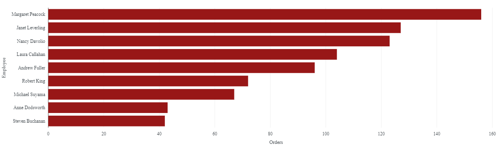

# Northwind Project

## Background
The management of Northwind, a fictional company, has requested a brief report analyzing data extracted from their database. This analysis requires the following steps:
* Load the data from multiple CSV files into a Databricks notebook.
* Review and understand the database schema.**
* Design and execute SQL queries to analyze and summarize the data.
* Create visualizations and summary report with three recommendations.

** Schema obtained at https://docs.yugabyte.com/preview/sample-data/northwind/

## Analysis and Report
### Global Reach and Customer Base
Northwind is a global food and beverage distribution company with 91 customers across 21 countries. Over 50% of their customers and orders are concentrated in 5 countries.

 

Recommendation: Analyze trends in customers, orders, and sales by quarter to determine areas of growth both in pursuing new customes and expanding sales for existing customers. Start with countries ranked 6th through 10th in customers and sales.

### Sales Depth and Strength
Northwind currently has 9 employees in sales that have generated almost 1.3 million in revenue. The top 3 employees with the highest revenue represent just under 50% of the total revenue as well as the total number of orders. The bottom 3 employees represent just under 20% of the total revenue as well as the total number of orders. Note that Steve Buchanan is the sales manager thus not all of his time is focused on revenue generation.

Recommendation: Obtain additional information from Andrew Fuller, VP of Sales, and Steve Buchanan to understand the variation in orders and revenue for each sales representative. There may be areas of improvement and redistribution of responsibilities and customer assignments to maximize total revenue and increase the customer base.

## Cost Analysis
The data provided does not include any cost allocations or indication of profitabilitity across customers, countries, or products. This information is critical for management decisions and the future of the company. Focusing growth in Austria or Ireland given hypothetical recent sales increases may hurt the company given the high costs (such as freight) of doing business in these countries.

Recommendation: Include financial information in the dataset and assess administrative costs and profitability minimally by territory, country and product category.